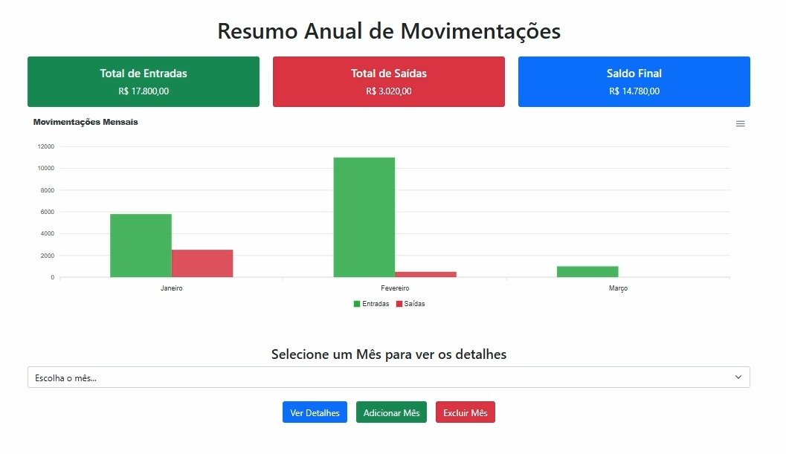
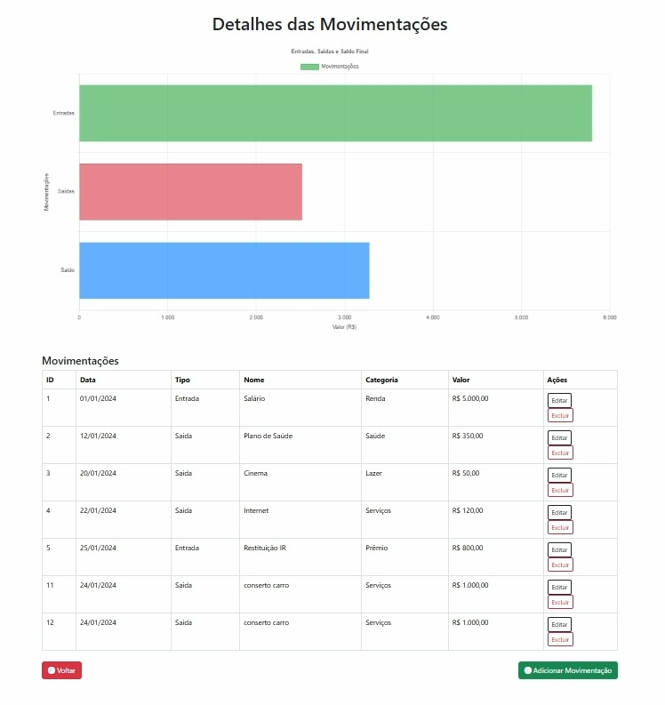
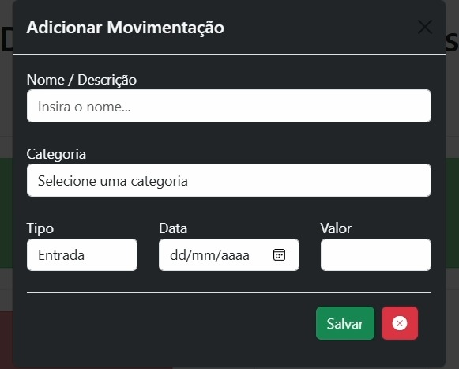
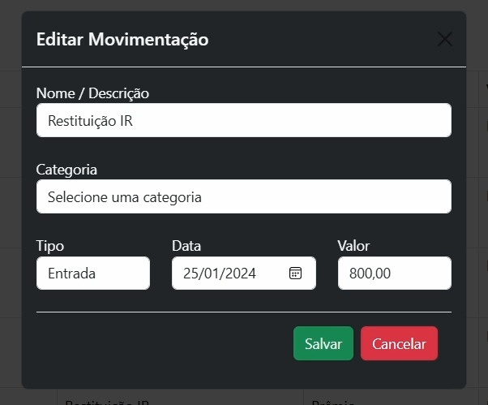

# 💰 Sistema de Gestão Financeira

## 📝 Sobre o Projeto

Um sistema financeiro desenvolvido como parte do projeto acadêmico da disciplina **Desenvolvimento Web**, ministrada no curso de **Análise e Desenvolvimento de Sistemas** da **Universidade UNIMAR**. O sistema é voltado para auxiliar a organizarem suas finanças de forma eficiente.

Este projeto foi elaborado por **Daniel Costa** e **Gustavo Henrique**, estudantes do segundo termo, com o objetivo de consolidar conhecimentos teóricos e práticos adquiridos ao longo do curso, aplicando tecnologias atuais do desenvolvimento web.

---

## 🌟 Funcionalidades

- **💼 Gestão Completa de Transações (CRUD)**:
  - Adição, edição, exclusão e listagem de transações financeiras.

- **📂 Categorias Dinâmicas**:
  - Permite selecionar categorias predefinidas.

- **📊 Relatórios Mensais**:
  - Controle de entradas e saídas organizados por mês, facilitando o acompanhamento financeiro.

---

## 🛠️ Tecnologias Utilizadas

- **HTML5** e **CSS3**: Estruturação e estilização de todas as páginas.
- **Bootstrap 5**: Criação de um layout responsivo e componentes prontos para uso.
- **PHP**: Desenvolvimento do backend e lógica de negócio.
- **JavaScript**: Funcionalidades interativas e validações no lado do cliente.
- **MySQL**: Banco de dados para armazenamento de categorias, meses e transações.
- **Git**: Controle de versão e colaboração entre os desenvolvedores.
- **ApexCharts**: Biblioteca JS para criação de Grafico para exibir resumo anual.
- **Charts**: Biblioteca JS para criação de Grafico para exibir detalhes do mês.


## 🚀 Como Executar o Projeto

### Pré-requisitos:
- Servidor local (como **XAMPP** ou **Laragon**)
- PHP 7.4 ou superior
- MySQL 5.7 ou superior

### Passos:
1. Clone este repositório:
   ```bash
    git clone https://github.com/userdanieldev/financeiro_controle

## 📫 Contato dos Desenvolvedores

- **Daniel Costa RA:1989218**  
  [GitHub](https://github.com/userdanieldev) | [LinkedIn](https://www.linkedin.com/in/daniel-costa-b88a07198/)

- **Gustavo Henrique RA:1992080**  
  [GitHub](https://github.com/GuVieir4) | [LinkedIn](https://linkedin.com/in/gustavo-henrique-vieira-da-silva-6284b7231)

---

## ✨ Resultados e Conclusão

Com o desenvolvimento desse sistema, conseguimos:
- Aplicar os conhecimentos de **Desenvolvimento Web** para criar um sistema funcional.
- Aprimorar habilidades em **POO**, integração de tecnologias e design responsivo.
- Desenvolver um projeto útil para a gestão financeira pessoal.

---

## 📸 Imagens do Projeto

  
*O index do projeto, basicamente a Home*

  
*Descrição das transações mensais de forma detalhada*

  
*Tela de criação de transação*

  
*Tela que oferece a opção de editar as transações*

---

## 🎥 Vídeo do Projeto

Assista ao vídeo demonstrativo do no [YouTube]().
